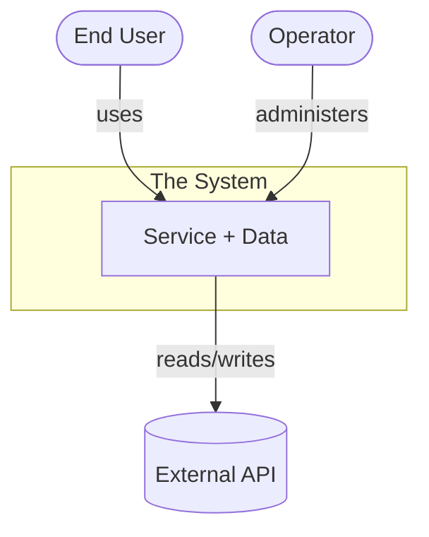
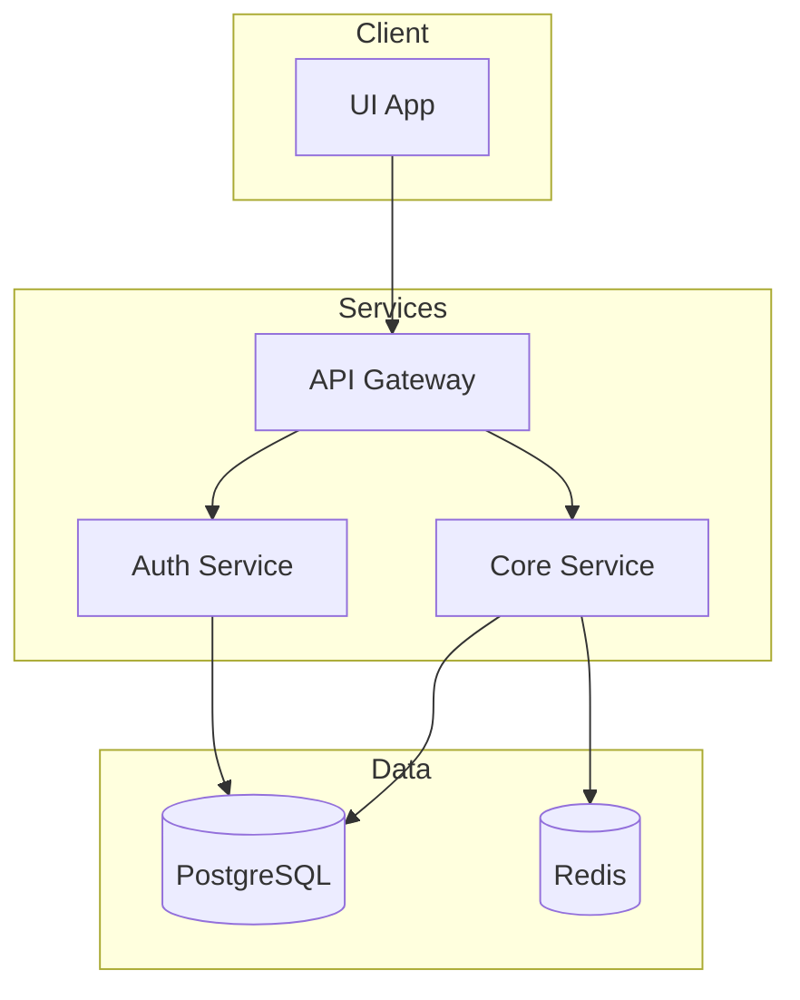
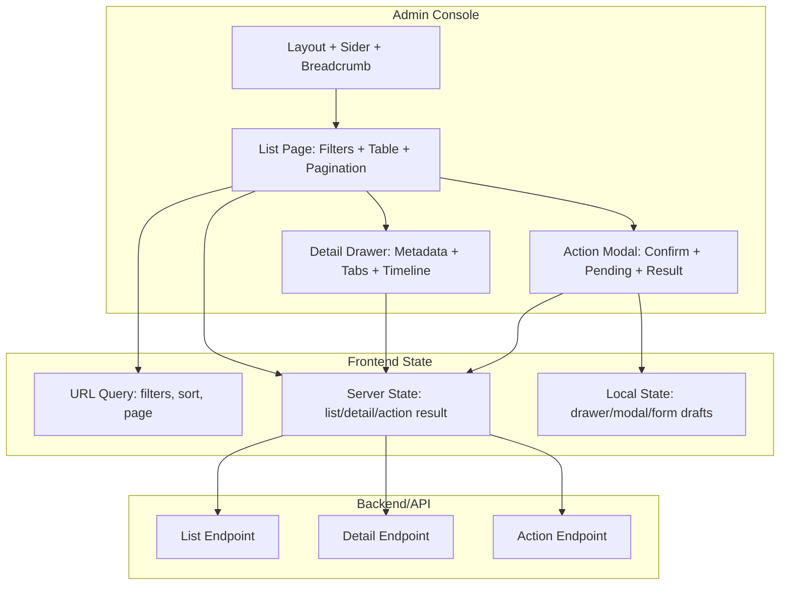
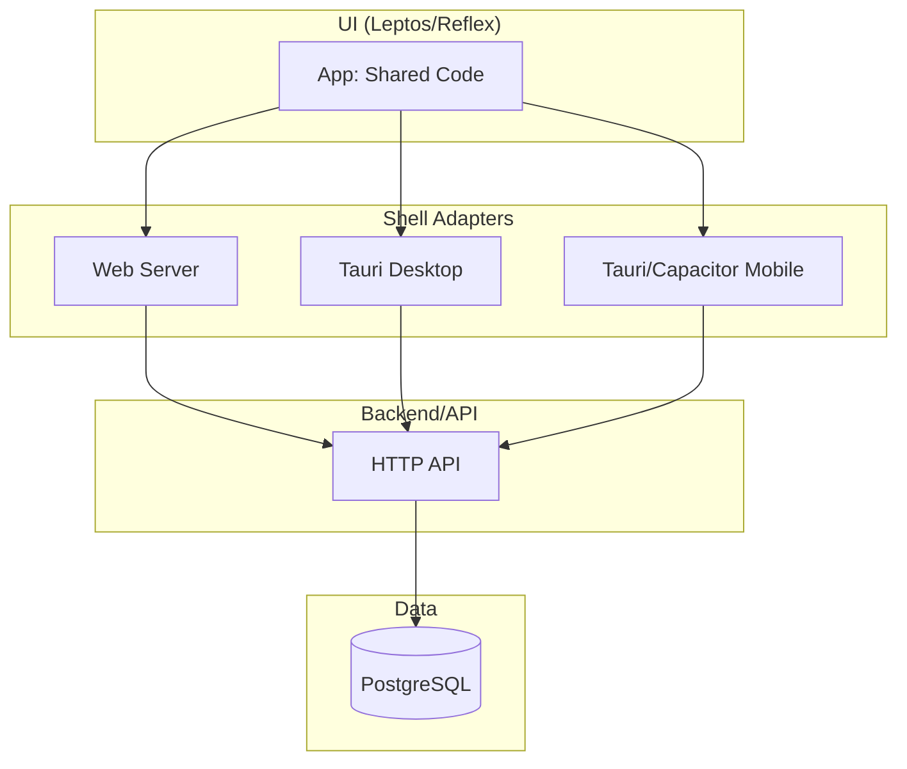
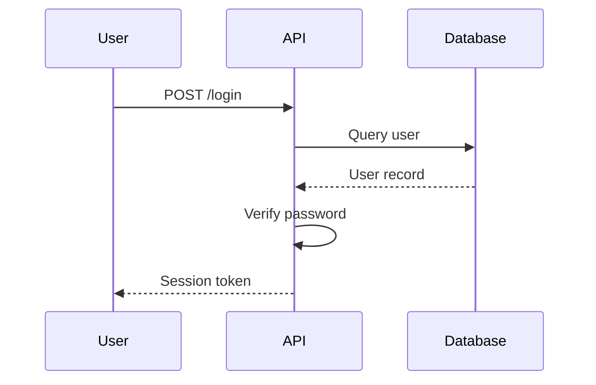
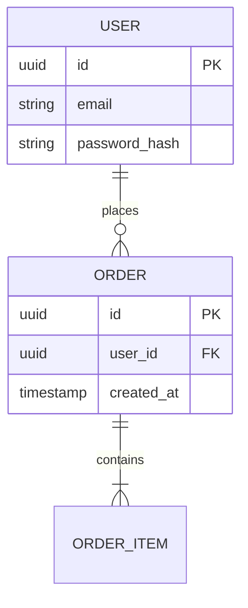

## Objective

Produce or update a comprehensive diagram set that lets a human or agent grasp the entire system quickly, and link it from `docs/architecture.md`. The goal is coverage at a glance: every major part of the system appears in at least one diagram, and the set reads top-down from a single high-level overview into the parts that need detail.

Default tool: Mermaid (diffable, in-repo, renders in GitHub and most viewers). Use another diagrams-as-code tool only if the repo already standardizes on one.

Output location: `docs/diagrams/` (one file per diagram or per zoom level) plus an index, with the top-level views embedded or linked in `docs/architecture.md`.

## Decision Standard

Act as the system's cartographer. One giant diagram is unreadable; a single diagram is not enough. Provide a layered set where each diagram is focused and readable on its own and the set together is comprehensive. Comprehensive means the whole system is covered, not that any single diagram is crammed: push detail down a zoom level rather than into one dense graph.

## Research Basis

- C4 zoom levels give a navigable spine: System Context (L1), then Container (L2), then Component (L3); stop before code level unless a part is genuinely tricky.
- Complement structure with behavior and data: a few runtime/sequence diagrams for the important flows, an ER diagram for the data model, and state diagrams for non-trivial lifecycles.
- Add a deployment/topology view when the runtime layout is not obvious.
- Diagrams as code: keep diagrams in the repo as text so they are diffable, reviewed in pull requests, and updated as part of the definition of done; drawn or binary diagrams rot.
- Keep each diagram focused and labeled; a connection should say why it exists.

## The Comprehensive Diagram Set

Produce these by default, and scale to the project: a small tool may merge several into one file, but the whole system must still be covered.

1. One-screen overview: the single diagram that orients everything — the system, its actors and external systems, and its top-level parts. This is the quick view of the entire project.
2. System Context (C4 L1): the system as one box with its users/operators and external systems, and the reason for each connection.
3. Container view (C4 L2): the deployable or runnable units (services, apps, CLIs, jobs, datastores) and how they communicate.
4. Component views (C4 L3): for each non-trivial container, its internal components and responsibilities. Skip trivial containers.
5. Key runtime sequences: the few flows that carry the system's value or its trickiest coordination (primary request path, auth, startup/discovery, failure/retry).
6. Data model (ERD): entities, keys, and relationships, aligned with `arch-model`.
7. State and deployment: state machines for non-trivial lifecycles, and a deployment/topology diagram when the runtime layout is not obvious.

Each diagram needs a title, a one-line statement of what it shows, labeled nodes (no mystery boxes), and edges that say why a connection exists.

## Inputs

Read, in order:

1. Explicit user instructions.
2. `docs/architecture.md` (System Context, Runtime View, Component View, Source Tree, Data and State) and the concept.
3. Repository evidence: actual services, entry points, datastores, and dependencies, so diagrams reflect reality, not aspiration.
4. Existing diagrams, to update rather than duplicate.

For UI-bearing systems, label the stack explicitly, for example `Product UI (Leptos/Reflex)`, `Admin Console (React + Arco/Semi)`, or `Existing UI (<repo stack>)`.

## Protocol

1. Inventory the system from the architecture and repo: actors, external systems, containers, key components, primary flows, entities, and deployment targets.
2. Draft the one-screen overview and the C4 spine (Context, Container, Component) so navigation works top-down.
3. Add the behavior, data, state, and deployment diagrams the system actually needs.
4. Label everything and state why each connection exists; keep each diagram within readable size by pushing detail to the next level.
5. Write the index and embed or link the top-level views in `docs/architecture.md`.
6. Verify each diagram renders as valid Mermaid and matches the current code.

## Output

Keep an index so the set is navigable and the entry point is obvious:

```markdown
# Architecture Diagrams

Start here: [System Overview](./system-overview.md)

| Diagram | Level | Shows |
|---|---|---|
| system-overview | overview | whole system at a glance |
| context | C4 L1 | actors and external systems |
| containers | C4 L2 | runnable units and data stores |
| <container>-components | C4 L3 | internals of a container |
| <flow>-sequence | runtime | a key flow |
| data-model | ERD | entities and relationships |
```

Each diagram file follows one shape:

````markdown
# <Title>

What this shows: <one line>.

```mermaid
<diagram>
```

Notes: <non-obvious context; links to architecture sections and source files>.
````

## Diagram Examples

System Context (C4 L1):



Container view (C4 L2):



Admin Console UI (React + Arco/Semi):



Use this shape for internal ops/review/monitoring consoles. Add `VChart` or `VTable` nodes only when the feature is genuinely dashboard-heavy or high-density analytical-table work.

Product UI target matrix (Leptos/Reflex):



Runtime sequence:



Data model (ERD):



## Execution Rules

1. Cover the whole system across the set; keep each diagram focused and readable.
2. Anchor structure on the C4 spine; add behavior, data, state, and deployment views as the system needs them.
3. Label every node and connection; no mystery boxes.
4. Keep diagrams as code in the repo and update them with the code they describe.
5. Verify Mermaid renders; link diagrams from `docs/architecture.md` and back to the relevant source.

## Completion Report

- Changed: full paths to diagram files and the index, and the architecture section updated.
- Checks: Mermaid render/validation run as `passed`, `failed`, or `not run`.
- Blockers: parts of the system not yet diagrammable and why.
- Next command: usually `arch-roadmap` or `workflow-boss`.
