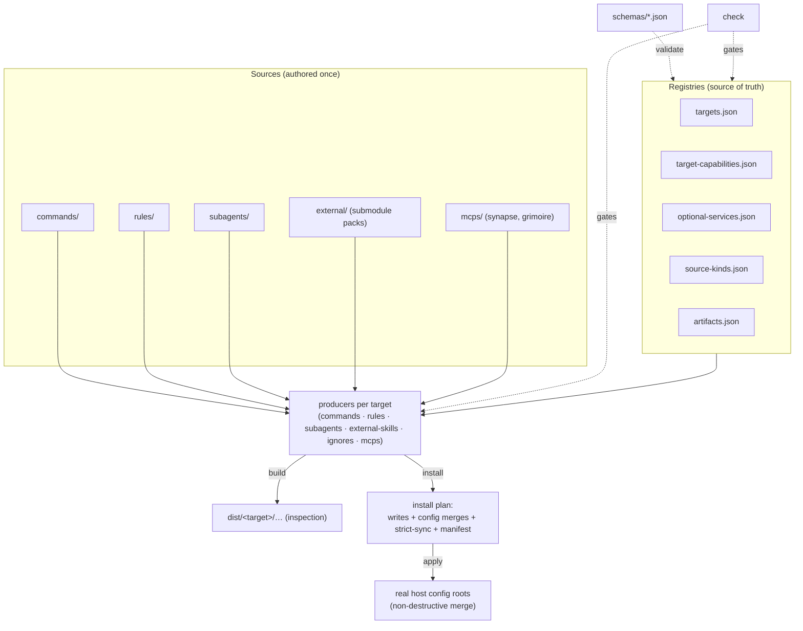

# Architecture — agent-surface

Status: IMPLEMENTED · Last updated: 2026-07-02 · Scope: the compiler under `scripts/` (the `agent-surface.mjs` CLI entry + the `agent-surface/` modules) and the registries/schemas that drive it. The two first-party MCP services have their own architecture docs: [../mcps/synapse/architecture.md](../mcps/synapse/architecture.md), [../mcps/grimoire/architecture.md](../mcps/grimoire/architecture.md).

## What it is

agent-surface is a **source-to-native compiler**. Author each surface once — commands, rules, subagents, external skill packs, ignore files, and first-party MCP services — and it renders them into the native formats of **20 agent-host targets**, then installs them non-destructively. One source tree instead of twenty bespoke configs. It is a set of zero-dependency Node ES modules behind one CLI entry point; **registries are the source of truth**, JSON Schemas validate them, and `check` gates every invariant.

## System context

- **Author** edits `commands/`, `rules/`, `subagents/`, and the registries. **Operator** runs `build` (to `dist/`) or `install` (to real host config roots).
- **Inputs**: the source dirs above; pinned external skill packs under `external/` (git submodules); the first-party MCP services under `mcps/`.
- **Outputs**: per-target native files (skills, workflows, instructions, plugins, MCP configs, ignore files) plus an install manifest per target.
- **Trust boundary**: the compiler only writes files it owns and **merges** (read-modify-write) into shared/secret-bearing host configs; it never clobbers user-owned entries.

## Pipeline



Each adapter declares a set of **producers**; every producer `emits` render tokens (e.g. `skills`, `rules`, `subagents`, `mcps`, `ignores`, `external`). Three sources must agree for every target, enforced by `check`: the producer's emitted tokens ↔ `targets.json` `renders` ↔ `target-capabilities.json` `generated_render_tokens`. Drift is a hard error.

## Source tree (key files)

```text
scripts/agent-surface.mjs   - CLI entry: arg dispatch over the command modules (main, help, inventory, commands registry). No runtime deps.
scripts/agent-surface/      - the compiler, split into focused zero-dependency ES modules:
  targets.mjs               - the engine: the per-target adapter table + producers + output planning.
  render.mjs · merge.mjs · postprocess.mjs · jsonc.mjs - emit: per-target renderers; non-destructive MCP merge (JSON/TOML/YAML); JSONC parse + surgical root-property merge (Kilo/OpenCode/Zed/VS Code); external-skill normalization.
  install.mjs               - build (→ dist/) + install (planner, config merges, strict-sync, backups, manifest).
  check.mjs                 - the validators behind `check` (registry/schema/producer coherence, generated output, references, workflow fixtures).
  workflow.mjs · evidence.mjs · doctor.mjs - workflow-ledger subcommands; `run` evidence capture (redaction/approval); environment + MCP health.
  commands.mjs · rules.mjs · source-primitives.mjs - source readers (commands + frontmatter, rules, subagents/ignores).
  registry.mjs · roots.mjs · io.mjs · proc.mjs · fs-tree.mjs · util.mjs · format.mjs - foundations: registry loaders; install roots + path/naming; FS read/parse; git/proc; dir listing; primitives; token formatting.
registry/
  targets.json              - the 20 in-scope targets + their render tokens + build/install support.
  target-capabilities.json  - per-target surface matrix (support/generation/scope/paths/notes) + generated_render_tokens.
  optional-services.json    - external packs + first-party MCP services (synapse, grimoire) + served_by links.
  source-kinds.json         - install scopes per source kind (commands/rules/subagents/ignores/external).
  artifacts.json            - output artifact classes.
schemas/*.json              - JSON Schemas validating every registry + the workflow ledger.
commands/  rules/  subagents/  - the authored sources (rendered per target).
adapters/<target>/README.md - per-target adapter notes (paths, quirks, MCP surface).
mcps/{synapse,grimoire}/    - first-party MCP services (own build/test/install; distributed via the MCP rails).
external/                   - pinned upstream skill-pack submodules.
tests/agent-surface.test.mjs - the snapshot/behaviour suite (repo `npm test`).
.github/workflows/ci.yml    - check job (Node 20) + mcp job (Node 22: grimoire+synapse suites, audits).
```

## Data and state

- **`dist/`** — build output for inspection/CI; never installed from directly.
- **Install manifest** (`.agent-surface/<target>-manifest.json` under each install root) — records every managed output with its sha256. On the next full install, **strict-sync** removes previously-managed outputs that are no longer generated (sha-guarded; user-modified files are kept), so de-scoped assets self-prune.
- **Config merges** — MCP wiring is merged, not overwritten, per format: JSON `mcpServers`/`servers`/`context_servers`, Codex TOML, JSONC `mcp` (Kilo/OpenCode), and YAML `extensions`/`mcp_servers` (Goose/Poolside). Merges preserve siblings/comments and are idempotent; a malformed or flow-style/tab-indented target **blocks** rather than corrupts.
- **Backups** land in `.agent-surface/backups/` before any overwrite or removal.

## Interfaces (CLI)

`build` · `install` (`--target`, `--scope user|project`, `--category`, `--service`, `--dest`, `--allow-scope-root`, `--dry-run`) · `check [commands|rules|subagents|generated]` · `inventory` · `doctor` · `workflow <apply|doctor|patch …>`. Install is **dry-run-first**: a live write to a real scope root needs `--allow-scope-root` or an explicit `--dest`.

## First-party MCP distribution

MCP services declared `first_party kind:"mcp"` in `optional-services.json` are auto-rendered and non-destructively merged into **all 17 MCP-capable hosts**. First-party secretless services (synapse, grimoire) are default-on; external/secret-bearing MCPs are opt-in via `--category mcps --service <id>`. A `served_by` link ties a de-scoped `source-pack` (e.g. `anthropic-cybersecurity-skills`) to the MCP that serves it just-in-time, enforced by the `checkServedBy` rule. Full matrix: [reference/targets.md](reference/targets.md).

## Quality gates

`npm run check` (registry/schema/producer coherence, source-kind + capability drift, external pins, served_by invariants) · `npm test` (behaviour snapshots incl. install plans, non-destructive/idempotent merges, strict-sync, MCP selection) · CI runs both plus the grimoire (real-pack eval gate) and synapse package suites on Node 22. `doctor` reports environment + first-party MCP health (linked bins, sidecar, grimoire index freshness vs the repo pin).

## Decisions

- **Registry-driven, schema-validated** — behaviour lives in data, not code branches; `check` makes the three registries agree with the producers.
- **Zero-dependency ES modules** — portability and auditability with no runtime deps; the former single ~4k-line script was decomposed into cohesive modules (CLI entry + engine + emit + command domains + foundations), verified byte-identical against the pre-refactor `build` output.
- **Merge, never clobber** — host configs are shared/secret-bearing; the compiler owns only its own keys and blocks on ambiguous shapes.
- **Strict-sync via manifest** — de-scoped assets self-prune on the next full install without tracking deletions by hand.
- **First-party MCP on shared rails** — synapse and grimoire ride the same generate+merge path; adding a service is a registry entry, not new plumbing.

## Risks

- New host MCP formats may need new merge logic (YAML added most recently) — each new format needs a non-destructive merge + block-on-ambiguity path and tests before a target is marked `generated`.
- External submodule pins can drift from a served index — surfaced by `doctor` (grimoire index freshness) and `check` (required-pack pins).
