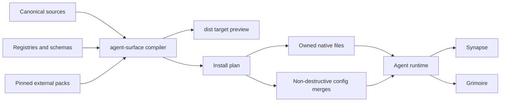

# Architecture

Status: IMPLEMENTED; REAL-RUNTIME QUALIFICATION PARTIAL
Source concept: `docs/context/concept-zero.md`
Last updated: 2026-09-21

## Executive Decision

`agent-surface` remains a single-process Node source-to-native compiler using Ajv and maintained JSONC, TOML, and YAML format libraries. The runtime refresh changes the curated portfolio from 22 to 25 implemented targets: retain 21 existing targets, add DSH, Qoder, Qwen Code, and Kiro, and retire VSCodium. Copilot, Grok Build, Antigravity CLI, and Trae receive in-place contract upgrades. The architecture keeps the existing registry + adapter table + renderer + non-destructive merge pipeline; it adds no adapter framework, daemon, datastore, provider manager, or general compatibility layer. Generated output and schema checks prove compiler behavior; only real host discovery and task-shaped execution prove runtime usability.

## Architecture Drivers

- `G-01` Curated portfolio: every target needs a current executable host, primary-source native contract, maintainer value, and an honest proof boundary.
- `G-02` Four additions: DSH, Qoder, Qwen Code, and Kiro must reuse existing compiler primitives where possible.
- `G-03` Four upgrades: Copilot CLI/Agent Host, Grok TOML, Antigravity CLI discovery, and Trae subagents must replace stale claims on their real paths.
- `G-04` One retirement: VSCodium-owned output must become removable by full-sync ownership rather than remain as dead configuration.
- `C-01` Preserve the existing Node ES-module stack; use maintained format libraries instead of local JSONC, TOML, or YAML parsers.
- `C-02` Keep configuration merging non-destructive and block malformed shared config.
- `C-03` Match implementation depth to evidence. DSH is developer preview and receives a skills-only adapter, not unstable profile/MCP composition.
- `Q-01` Registry, capabilities, adapter producers, docs, and generated output agree for every target.
- `Q-02` Unknown user config siblings survive semantically; comments outside regenerated owned subtrees remain intact.
- `Q-03` Native runtime inventory and task execution, not file presence alone, establish usability.
- `Q-04` Retirement removes only manifest-owned files and config entries.

Unacceptable outcomes are a target that cannot discover its files, a provider represented as a runtime, a removed target that leaves managed residue, an adapter that overwrites user configuration, or abstractions larger than the host-specific behavior they replace.

## Evidence and Source Reconciliation

- `IMPLEMENTED`: `registry/targets.json`, `registry/target-capabilities.json`, `scripts/agent-surface/targets.mjs`, and `scripts/agent-surface/roots.mjs` implement the 25-target matrix.
- `VERIFIED_EXISTING`: `check` enforces producer-token/registry/capability agreement, and install manifests own strict-sync cleanup.
- `IMPLEMENTED`: the peer Grimoire multi-pack delta was independently reviewed and remediated for provenance, attribution, publication cleanup, symlink ingestion, doctor consistency, and contract drift.
- `IMPLEMENTED`: Grok uses `.grok/config.toml`; Antigravity CLI uses `~/.gemini/antigravity-cli/plugins`; Copilot CLI uses its native skills/agents/instructions/MCP roots.
- `IMPLEMENTED`: current TraeCode Markdown subagents and CLI TOML policy supplement the retained IDE skill/rule/MCP routes.
- `DEPRECATED`: Gemini CLI is no longer a general individual-user target; Roo Code is archived; iFlow CLI shut down.
- `ADOPTED`: DSH filesystem skills, Qoder native files, Qwen Code native files, and Kiro `.kiro` files as documented in concept evidence `E-02` through `E-06`.
- `DEFERRED`: Amp, Auggie, Warp, and Crush pending a later usage-ranked real probe.

## System Context and Boundaries

Actors:

- The author maintains canonical skills, explicit commands, rules, subagents, asset categories, optional services, and runtime evidence.
- The operator builds for inspection or installs to user/project/custom roots.
- Agent runtimes consume generated native files and connect to first-party MCP services where the target contract supports MCP.
- External skill packs remain pinned inputs; model providers, credentials, subscriptions, runtime binaries, and editor extensions remain outside the compiler boundary.


```mermaid
flowchart LR
  A[Canonical sources] --> C[agent-surface compiler]
  R[Registries and schemas] --> C
  P[Pinned external packs] --> C
  C --> D[dist target preview]
  C --> I[Install plan]
  I --> F[Owned native files]
  I --> M[Non-destructive config merges]
  F --> H[Agent runtime]
  M --> H
  H --> S[Synapse]
  H --> G[Grimoire]
```

The compiler never owns provider keys, login state, model selection, session history, runtime databases, or host-generated memory. It owns only generated files and named config entries recorded in its install manifest.

## Selected Architecture

### Runtime View

`node scripts/agent-surface.mjs <command>` starts one short-lived process. It reads canonical sources and JSON registries, resolves one or more target adapters, produces files in memory, and either writes a disposable `dist/<target>` preview or applies an install plan. Build and install share the same producer functions. No background process or network call is required by compilation.

First-party MCP processes are separate products. Their distribution entries are rendered into host config; their lifecycle remains owned by `mcps/synapse` and `mcps/grimoire`.

### Component View

- **Source readers** own parsing of skills, commands, rules, subagents, ignores, and external packs. They do not know runtime paths.
- **Portfolio registries** own target lifecycle, rendered surface tokens, capability evidence, asset-category membership, and optional service declarations.
- **Target adapter table** owns the mapping from canonical source kinds to native roots/renderers/config formats. It does not parse shared config or perform writes.
- **Renderers** own host-specific file syntax. A renderer should exist only when a generic vanilla skill/instruction/agent renderer cannot represent the host contract.
- **Merge layer** owns format-aware read-modify-write behavior for shared JSON/JSONC/TOML/YAML config. It preserves unknown siblings and rejects ambiguous shapes.
- **Installer** owns plans, manifests, strict-sync, obsolete-route cleanup, and actual writes.
- **Checks/tests** own registry coherence, native shape assertions, merge discrimination, generated output, and install behavior.
- **Runtime proof** is outside compiler PASS. It invokes the real host, checks native discovery, calls MCP where claimed, and observes exact world state.

### Portfolio Shape

Add now:

- `dsh`: `skills`, `external`; user `~/.dsh/skills`, project `.dsh/skills`. No rules, agents, commands, or MCP claim during developer preview.
- `qoder`: `skills`, `commands`, `rules`, `subagents`, `external`, `mcps`; roots under `~/.qoder` / `.qoder`, with `AGENTS.md` and JSON `settings.json` MCP merge.
- `qwen-code`: `skills`, `commands`, `rules`, `subagents`, `external`, `mcps`; roots under `~/.qwen` / `.qwen`, with JSON `settings.json` MCP merge.
- `kiro`: `skills`, `commands-as-workflows`, `rules`, `subagents`, `external`, `mcps`; roots under `~/.kiro` / `.kiro`, steering files, v3 agent definitions, capability permissions, and `settings/mcp.json`.

Modify now:

- `copilot`: add user/project native custom agents, instructions, skills, and MCP; retain the VS Code user instruction output where it is still consumed.
- `grok-build`: move MCP/config ownership to `config.toml`; retain native `.grok/skills` and `AGENTS.md` compatibility.
- `antigravity-cli`: move CLI plugin output to the active staged plugin root and update path claims.
- `trae`: retain IDE skill/rule/MCP routes while adding CLI-native `.traecli/skills`, `.traecli/agents`, current native rule directories, and user CLI TOML policy.

Retired:

- `vscodium`: adapter, capability entry, docs row, generated minimum, and dedicated output removed; listed as out of scope. A cleanup-only adapter remains so `install --target all` removes its stale outputs (see Operations).

### Source Tree and File Responsibilities

```text
agent-surface/
  docs/context/concept-zero.md       - Accepted runtime portfolio and primary-source evidence; no implementation details.
  docs/architecture.md               - Runtime compiler boundaries, source ownership, data, and interfaces.
  docs/roadmap.md                    - Ordered implementation and proof plan.
  docs/reference/targets.md          - User-facing target matrix and lifecycle notes.
  registry/targets.json              - Canonical implemented/planned/out-of-scope portfolio and render tokens.
  registry/target-capabilities.json  - Canonical per-target native surface contract and evidence links.
  schemas/targets.schema.json        - Structural validation for portfolio records; no popularity scoring.
  scripts/agent-surface/
    roots.mjs                        - Pure user/project path resolution for all target-native roots.
    targets.mjs                      - Adapter table, producers, static outputs, and generated minimums.
    render.mjs                       - Only materially distinct host-native document renderers.
    merge.mjs                        - Shared JSON/JSONC/TOML/YAML config merges; no target lifecycle policy.
    install.mjs                      - Build/install plan, manifest ownership, strict-sync, and stale-route cleanup.
    check.mjs                        - Registry/producer/evidence/generated coherence gates.
  adapters/
    dsh/README.md                    - Limited preview contract and omitted-surface rationale.
    qoder/README.md                  - Qoder roots, native formats, and proof commands.
    qwen-code/README.md              - Qwen roots, native formats, and proof commands.
    kiro/README.md                   - Kiro shared IDE/CLI roots and proof commands.
    copilot/README.md                - Copilot CLI plus VS Code Agent Host ownership.
    grok-build/README.md             - Current TOML and native discovery contract.
    antigravity-cli/README.md        - Active staged plugin contract.
    trae/README.md                   - Current skills/rules/subagent/MCP contract.
  tests/suites/
    matrix.test.mjs                  - Portfolio count, lifecycle membership, and adapter presence.
    build.test.mjs                   - Native output paths/content for added and modified targets.
    install.test.mjs                 - Non-destructive config merges and cleanup-only retired-target reconciliation.
    check.test.mjs                   - Registry/producer drift discrimination.
    install-live.test.mjs            - Real disposable filesystem installation; no host substitution claim.
```

Production files already present outside this tree retain their responsibilities from the previous architecture. The runtime refresh does not move MCP implementation, workflow ledger, source parsing, or external-pack ownership.

## Data and State

### Canonical domain model

- **Target**: stable `id`; lifecycle membership (`in_scope`, `planned`, `out_of_scope`); implemented status; build/install flags; render-token set.
- **Capability record**: target `id`; summary; generated-token set; primary evidence links; native surface records containing support, generation mode, scopes, paths, and limits.
- **Adapter**: runtime behavior keyed by target `id`: native roots, renderer functions, producer categories, config merge declaration, and install root resolver.
- **Install manifest**: target/scope-owned generated paths and named MCP config-entry ownership used for idempotency and strict-sync cleanup. Root policy values merged into shared host configs are persistent operator policy, not lifecycle-owned snapshots; retirement removes generated files and owned MCP IDs but does not guess or restore a previous policy value.
- **Optional service**: external pack or MCP service, distribution defaults, and served-by relationships.

Identity invariant: one target ID appears exactly once in each applicable registry and adapter table. Token invariant: adapter producer emissions, `targets.json.renders`, and capability `generated_render_tokens` are equal as sets. Lifecycle invariant: a target cannot appear in more than one portfolio bucket. Ownership invariant: the installer may delete or overwrite only manifest-owned paths/entries.

No new persistent store is introduced. Registry JSON and install manifests remain the systems of record. `dist/` is disposable derived output. Runtime sessions, credentials, model state, and host caches are explicitly not stored.

Migration posture:

- Added targets create new manifests on first install.
- Modified routes are emitted at their current native paths; full sync treats obsolete previously owned routes as removals.
- Retired VSCodium is not buildable or directly selectable. A full user-scope `--target all` install runs its cleanup-only adapter before active targets, removes old manifest-owned files/config entries, preserves unknown user files, and then lets active targets rewrite any shared outputs.
- Registry format is unchanged, so there is no schema/data migration.

## Interfaces and Contracts

### CLI

- `build --target <id>`: deterministic preview under `dist/<id>`; no host acceptance claim.
- `install --target <id> --scope user|project [--category ...] [--service ...]`: produce a plan and, with configured write consent, apply files/config merges plus manifest updates.
- `check`: validate registry schemas, lifecycle/token coherence, source references, external pins, and adapter contracts.
- `check:generated`: rebuild all implemented targets and compare expected output.
- `doctor`: inspect local runtime/MCP/install health; diagnostics are evidence, not automatic repair.

Unknown target IDs fail before writing, and `all` must be supplied alone on `--target` and `--category` so a sibling selector is never dropped or left unvalidated. Scope support is adapter-owned. An unfiltered full install reconciles the general baseline, including removal of previously managed opt-in assets. Category-only installs are additive and prune only the selected category, so an installation profile is the general sync followed by each desired category. Retired-target cleanup runs only for an unfiltered full user-scope `--target all` install.

One output can carry several categories' contributions — a host whose rules are one concatenated instruction document is the case that matters. Regenerating such a file under a narrower selection would erase the rest, so a category-filtered install that would overwrite an output the manifest records as owned by an unselected category is rejected before writing, naming the owner. Per-file rule hosts are unaffected, since each rule is its own managed output. The manifest records one owning category per output, which is enough to detect that loss and not enough to reconstruct a multi-category document, so the contribution is restored by re-running its own category rather than reassembled; the general full sync still resets it deliberately.

A canonical skill is a directory, not a file. Alongside `SKILL.md` it may carry the material that body references, and those companions travel with it: they are emitted beside the rendered skill wherever the host uses a directory-shaped skill surface, so a relative reference resolves from the installed location rather than only in this checkout. Each companion is its own managed output, so deleting one at the source removes it from the next install while unmanaged files in the same directory are preserved. Companions are admitted by the same extension allowlist the external packs use and read as UTF-8 text; binary assets are not carried. An executable bit is preserved where the filesystem expresses one.

A target may instead be an **export format**, declared `buildOnly`. It renders a package for another tool's own installer and has no install destination of its own, so `install` refuses it by name and `--target all` skips it rather than inventing a location. The `codex-plugin` pilot emits one plugin package — a portable manifest carrying the schema identifier that format requires, plus a local marketplace manifest — with one canonical skill and its companion files. Whole-catalog contracts do not apply to such a target; its own narrower contract is that it packages exactly the skills it declares, rendered from canonical source.

### Adapter contract

An adapter is a plain object consumed by `targetProducers`. It may define native roots, renderer functions, static outputs, ignored-file output, and one or more MCP config declarations. New adapters must prefer existing functions. A host-specific renderer or merge format is justified only when the official native shape cannot be represented by an existing one.

### Boundary mapping

- Canonical `Skill` -> native skill folder/file. Frontmatter unsupported by a host may be preserved only when ignored safely; invocation claims must match host behavior.
- Canonical manual command -> native explicit command where supported, otherwise an explicit-only compatibility skill. It must never become implicitly model-invocable on a host that honors the control field.
- Normalized `Subagent` -> native agent definition. Tool/access mapping belongs to the renderer; source roles never contain host tool names.
- Canonical rules -> one always-on instruction document or native rule files; scoped rules remain references unless the host has a proven scoped-rule contract.
- Optional MCP service -> named native config entry. The compiler exposes command/args/env-free definitions for first-party local services and never serializes secrets.

Internal adapter objects and install manifests are not public runtime DTOs. Only native generated files and CLI behavior cross the boundary.

Compatibility policy: target IDs and documented paths are stable while implemented. A host lifecycle or breaking native-format change permits a targeted migration with strict-sync cleanup and changelog/docs update. Preview targets may lose unsupported surfaces rather than retain false compatibility.

## Security, Privacy, and Abuse Cases

Real assets are shared host configs, credentials already present beside generated entries, executable plugin/skill content, and pinned external packs.

- Shared config is parsed structurally and merged by owned key; malformed or unsupported shapes block writes.
- Secrets remain environment/keychain/user-owned and are never copied into registry or generated config.
- External packs are pinned and either copied through declared roots or served through Grimoire; their content is evidence/instructions, not authority.
- Manual destructive workflows remain explicit-only. Runtime full-access policy is a user-selected operating mode, not permission to fake proof or disclose credentials.

No new security layer is added for hypothetical hostile local users. Existing filesystem permissions and host runtime trust remain the deployment boundary.

## Operations

Build and deterministic tests run on a maintainer build host; MCP packages use a Node version satisfying their manifests. Runtime discovery may run locally when the installed authenticated host is the evidence target. Test workspaces and generated runtime state must be disposable and cleaned after proof.

Target refresh procedure:

1. Verify primary docs/releases and local binary behavior.
2. Update concept decision when lifecycle or product identity changes.
3. Change registry, adapter, docs, and tests as one concern.
4. Run `check`, focused tests, full root tests, generated checks, and package checks remotely.
5. Install into disposable roots and run native host inventory.
6. Run a task-shaped real journey where login/provider access exists; otherwise report `BLOCKED` precisely.

## Quality Scenarios and Fitness Gates

- `Q-01`: `npm run check` plus `npm run check:generated` on the remote clean worktree.
- `Q-02`: focused install tests seed unknown sibling entries, install the target, and compare retained values.
- `Q-03`: runtime-specific inventory (`skills`, `agents`, `mcp`, `inspect`, or equivalent) plus an exact artifact journey.
- `Q-04`: a real disposable old VSCodium manifest and config route are removed by full user-scope sync while an unowned sibling survives.
- DSH preview gate: pinned `@deepseek-ai/dsh` clean-room skill listing; MCP is explicitly not part of PASS.
- Peer-delta gate: independent review of `fc7fd4e..5dcc388`, Grimoire package suite, public served-row provenance checks, and real multi-pack index/search.

## Architecture Decisions

### ADR-R1: Curated portfolio over exhaustive catalog

Status: ACCEPTED. Add only hosts with current native contracts and operator value. Consequence: some credible agents remain planned. Rejected: logo-count expansion with shallow adapters.

### ADR-R2: Existing adapter table remains the extension mechanism

Status: ACCEPTED. Add plain entries and a few pure path/renderer helpers. Consequence: some target-specific code remains explicit. Rejected: an adapter DSL or plugin runtime with more concepts than current requirements.

### ADR-R3: DSH is skills-only during developer preview

Status: ACCEPTED. Use documented filesystem roots and avoid Cordis profile internals. Trigger to revisit: a stable declarative user/project MCP contract.

### ADR-R4: VSCodium is retired as a runtime target

Status: ACCEPTED. VSCodium remains an editor fork that can consume manually installed extensions, but agent-surface no longer presents it as a selectable runtime target.

### ADR-R5: Z.ai remains provider configuration, not a target

Status: ACCEPTED. Provider and API-plan setup stays user-owned. Qoder/Qwen/other actual hosts receive adapters independently.

## Risks, Debt, and Revisit Triggers

- DSH can break filesystem or metadata behavior during preview. Revisit on a stable release or failed pinned probe.
- Proprietary Qoder/Kiro runtime acceptance may be installation or login blocked. Compiler and disposable-install proof remain separate from native task execution.
- Grok TOML field names can differ from Codex TOML. Keep a small target-specific mapping and validate with `grok inspect`.
- The current Kilo user config contains obsolete user-owned keys that make Kilo reject the file. Repair local state during runtime proof; do not add a general migration engine for keys agent-surface never owned.
- Amp/Auggie/Warp/Crush may prove more valuable than a retained low-use target. Revisit after observing real operator use or a direct user request.
- The peer Grimoire branch remains under independent re-review after its confirmed defects were fixed; unresolved Critical/High behavior would block publication of that delta.

## Implementation Guardrails

- Keep source readers independent of target paths and target renderers independent of filesystem writes.
- Keep dependencies limited to the maintained format libraries used by config and frontmatter editing; do not add an adapter framework, generic provider layer, or runtime database.
- Prefer native skill roots and existing renderers. Add no unsupported render token to make target counts look comprehensive.
- Keep every new target change coherent across registry, capabilities, adapter README, adapter table, roots, tests, and user docs.
- Test the behavior being changed. No substitute-backed result counts as runtime, integration, E2E, or acceptance proof.
- Preserve the intentional dirty external submodules and the peer's existing Grimoire commit while reviewing and extending the branch.
