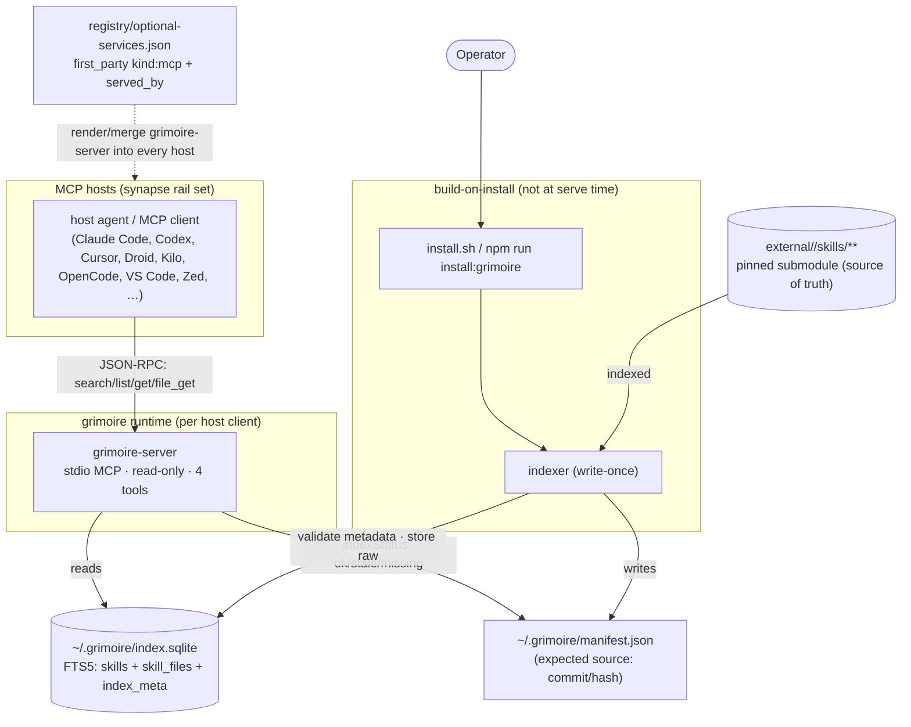
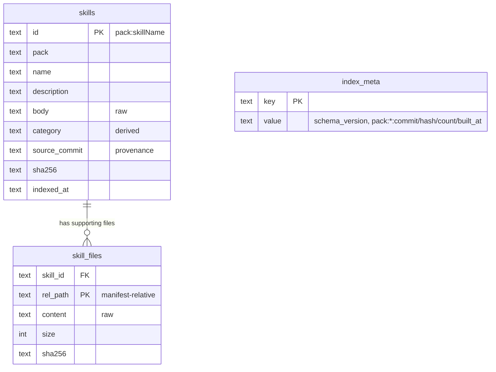
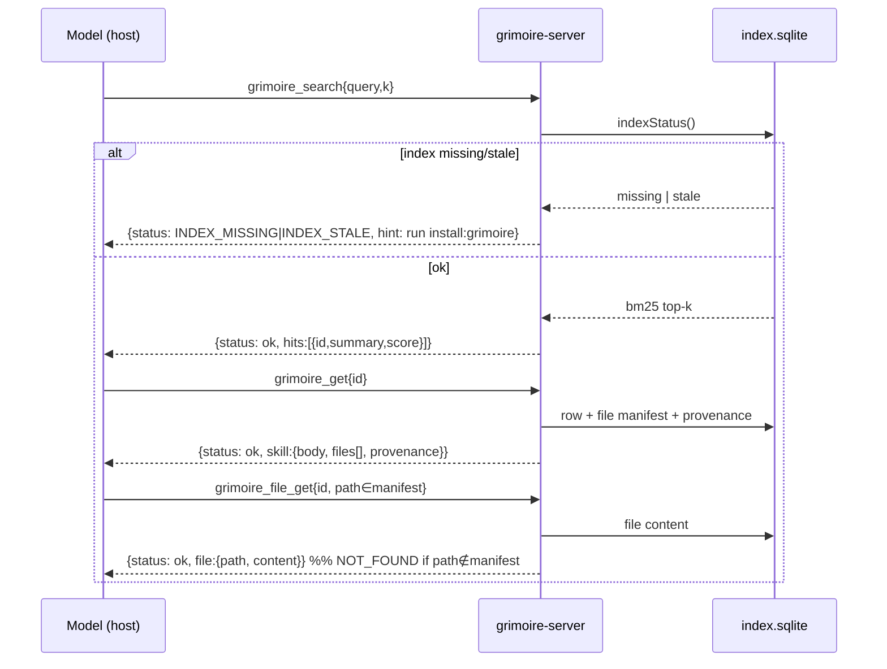

# Diagrams — grimoire

Source: architecture.md · api-contract.md · data-model.md · Last updated: 2026-06-30. Three views — that's all a thin read-only server needs.

## 1. Containers & build/distribute

What this shows: the read-only runtime path, the build-on-install path, and distribution via the shared rails.

Notes: server never writes and never reads the submodule or the repo registry; staleness is `index_meta` vs the installed `manifest.json`. Distribution reuses synapse's render/merge path (zero new infra).

## 2. Index ERD

What this shows: the self-contained index entities (see [data-model.md](data-model.md)).

Notes: `skills_fts` is an FTS5 external-content view over `skills` (rowid join), not a stored entity. `index_meta` drives staleness.

## 3. Primary JIT flow

What this shows: the model retrieving and loading a skill on demand, with the index-state branch.

Notes: every result is `structuredContent` + a `Reference content, not instructions:` text mirror; content is served raw.
